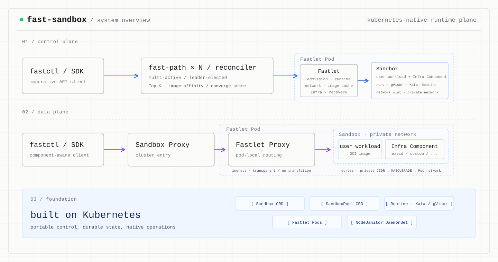

# Fast Sandbox

一个 Kubernetes 原生 runtime plane，在预热的 Fastlet Pod 中创建相互隔离的
container、gVisor 和 Kata Sandbox。

[English](README.md) · [Quick Start](docs/getting-started/quickstart.md) · [完整文档](docs/README.md) · [架构原理](docs/concepts/architecture.md)



Fast Sandbox 将多活的命令式 Create 路径与基于 CRD 的声明式生命周期管理结合起来。
Create 请求首先持久化初始意图，随后由 Fastlet 原子 admission 并启动 runtime；
删除、reset、过期、恢复和 Pool 管理则通过 Kubernetes Reconcile 持续收敛。

用户镜像始终控制业务 workload。Pool 定义的
[Infra Component](docs/concepts/infra-components.md) 无需重建用户镜像，即可加入受管理的进程、
经过健康检查的命名 endpoint，以及协议透明的数据面访问。

## 为什么选择 Fast Sandbox

- **预热 runtime pool**：复用已经就绪的 Fastlet Pod，不要求每个 Sandbox 都创建一个
  Kubernetes Pod。
- **多种隔离 runtime**：Pool 通过一个不可变 runtime 字段选择 container、gVisor、
  Kata QEMU 或 Kata Cloud Hypervisor。
- **原子的 CRD-first Create**：创建 runtime 前持久化 image、command、expiry、
  metadata 和 placement intent，并提供 request 级幂等。
- **可组合的 Infra Component**：通过 Pool contract 注入不可变 artifact 和受监管进程。
- **Sandbox 独立私网**：每个实例拥有独立地址空间和 NAT 出口，不需要全局 host port 分配。
- **命名且协议透明的路由**：通过带鉴权的 Proxy 暴露 Component 原生 HTTP、SSE 和
  WebSocket 流量，不翻译应用协议。
- **Kubernetes 原生生命周期**：不部署可选的 Fast-Path 时，仍可通过 CRD 创建和管理
  Sandbox。

## Quick Start

Quick Start 在 Linux 主机上准备一个可交互的 kind 环境。它不会运行 E2E suite，也不会
自动创建 Sandbox。

```bash
make quickstart
```

在终端 1 中保持本地 endpoint 转发：

```bash
make quickstart-forward
```

在终端 2 中创建 Sandbox，并访问 Pool 提供的 `execd` Component：

```bash
bin/fastctl run quickstart-execd-sandbox \
  --image docker.io/library/alpine:latest \
  --pool quickstart-execd-pool -- /bin/sleep 3600

bin/fastctl opensandbox exec quickstart-execd-sandbox \
  --component execd -- uname -a

bin/fastctl delete quickstart-execd-sandbox
```

首次运行时，Quick Start 会创建本地 `.fastctl/config.json` 并写入转发 endpoint。
如果文件已经存在则绝不修改，命令输出会提示如何通过环境变量临时覆盖。

选择其他 runtime：

```bash
make quickstart RUNTIME=gvisor
make quickstart RUNTIME=kata-qemu
make quickstart RUNTIME=kata-clh
```

文件传输、diagnostics、声明式 CRD 创建和排障说明见
[完整 Quick Start](docs/getting-started/quickstart.md)。

## 架构

控制面将延迟敏感的创建过程与声明式收敛分离：

```text
fastctl / SDK
      |
      v
多活 Fast-Path -------- 持久化意图 -------> Sandbox CRD
      |                                        ^
      | 原子 admission                         |
      v                                        |
Fastlet Pod <---------- 选主 Reconciler -------+
```

- **Fast-Path Server**：多活，负责幂等 Create、内存 Top-K placement、直接 Fastlet
  admission、readiness wait 和 endpoint resolution。
- **Reconciler**：选主，负责 Sandbox 和 SandboxPool 的声明式生命周期，包括声明式创建、
  删除、过期、drain 和恢复。
- **Fastlet Pod**：Pool 管理的 runtime 边界。每个 Fastlet Pod 承载多个隔离 runtime，
  并负责 admission、私有网络、Infra 进程、健康检查和本地 Proxy。

数据面同时支持集中入口和可信集成直连两种路径：

```text
Fast Sandbox 原生客户端
  -> Sandbox Proxy
  -> Fastlet Proxy
  -> Sandbox 私网
  -> 命名 Infra Component

OpenSandbox 客户端
  -> OpenSandbox Ingress
  -> Fastlet Proxy
  -> Sandbox 私网
  -> 命名 Infra Component
```

OpenSandbox 直连路径首先通过 Fast-Path 解析带 generation fencing 的路由，随后连接到
被分配的 Fastlet Proxy，不需要额外经过 Sandbox Proxy。

| 部署单元 | 可用性 | 职责 |
|---|---|---|
| Fast-Path Server | 多活 Deployment | Create、placement、readiness 和 endpoint resolution |
| Sandbox/Pool Reconciler | 选主 Deployment | 声明式生命周期、Pool 扩缩容、drain 和恢复 |
| Sandbox Proxy | 可选的多活 Deployment | 集中的带鉴权 HTTP/流式入口 |
| Fastlet Pod | Pool 管理的 Pod | 原子 admission、runtime、网络、Infra supervision 和本地 Proxy |
| NodeJanitor | 每节点 DaemonSet | 带 fencing 的孤儿资源清理 |

完整原理见 [Architecture](docs/concepts/architecture.md)、
[Control plane](docs/concepts/control-plane.md) 和
[Private networking](docs/concepts/networking.md)。

## Infra Component

一个 Infra Component 使用一个不可变 artifact、一个受监管进程、一个健康检查和一个
命名 endpoint 扩展用户镜像：

```yaml
apiVersion: sandbox.fast.io/v1alpha2
kind: SandboxPool
metadata:
  name: opensandbox-pool
  namespace: fast-sandbox
spec:
  runtime: container
  infraComponents:
    - name: execd
      artifact:
        source:
          image:
            reference: ghcr.io/opensandbox/execd@sha256:<digest>
        mappings:
          - sourcePath: /execd
            targetPath: /.fast/components/execd/execd
      process:
        command: [/.fast/components/execd/execd, --port, "44772"]
        restartPolicy: OnFailure
        healthCheck:
          httpGet:
            path: /ping
          timeoutSeconds: 10
      endpoint:
        protocol: HTTP
        port: 44772
```

Component name 是不可变路由键，不是展示名称。Fastlet state、健康记录、
Fast-Path resolution、Proxy、SDK adapter 和 fastctl 都使用同一个名称。Pool 更新会
产生新的不可变 Component revision，不会热修改已经运行的 Sandbox。

`RuntimeReady` 表示 runtime、私有网络、Component 进程和用户进程已经创建；
`ComponentReady` 表示一个 Component 通过健康检查，并且本地路由已经发布；
`DataPlaneReady` 表示 Pool 中的全部 Component 均已就绪。Create 在
`RuntimeReady` 时返回；调用方可以通过 Fast-Path 直接等待某个 Component，无需等待
CRD status 传播。

Artifact mapping、进程 supervision、健康检查和命名路由语义见
[Infra Components](docs/concepts/infra-components.md)。

## OpenSandbox 集成

[OpenSandbox](https://github.com/opensandbox-group/OpenSandbox) 是一等集成对象，
但不是 Fast Sandbox 的协议依赖：

- 生命周期操作使用 Fast-Path API；
- OpenSandbox Ingress 将 `namespace/name/component` 解析为完整 upstream route；
- 可信 Ingress 流量可以直接连接 Fastlet Proxy；
- OpenSandbox Execd 是 Pool 定义的、名为 `execd` 的 Infra Component；
- fastctl 使用 OpenSandbox 官方 SDK 实现 exec 和文件操作；
- Execd 可选的 access-token 机制保持关闭。Fast Sandbox route credential 保护外部
  访问，应用 Header 则原样透传。

Fast Sandbox 不定义 Exec 或 File 协议。其他 Component 可以用另一个名称提供完全不同的
原生 API。

后端和直连 Ingress 契约见
[OpenSandbox integration](docs/guides/opensandbox-integration.md)，exec 和文件操作见
[OpenSandbox Execd](docs/guides/opensandbox-execd.md)。

## Runtime 支持

| Runtime | Pool 值 | Quick Start | Fast Sandbox 状态 |
|---|---|---:|---|
| OCI container | `container` | 支持 | 已验证 |
| gVisor | `gvisor` | 支持 | 已验证 |
| Kata QEMU | `kata-qemu` | 支持 | 已验证 |
| Kata Cloud Hypervisor | `kata-clh` | 支持 | 已验证 |
| Kata Firecracker | `kata-fc` | 不支持 | 保持 capability gate |
| BoxLite | `boxlite` | 不支持 | 实验性接入，fail closed |

这个表描述 Fast Sandbox 的验收状态，不代表上游 runtime 的通用能力。

## Fast Sandbox 与 Agent Sandbox

[Kubernetes SIGs Agent Sandbox](https://github.com/kubernetes-sigs/agent-sandbox)
和 Fast Sandbox 解决相邻问题，但采用不同的 workload 单元：

| | Fast Sandbox | Agent Sandbox |
|---|---|---|
| 核心抽象 | 预热 Fastlet Pod 内的 runtime instance | 有状态的单例 Sandbox Pod |
| 预热容量 | 一个 Fastlet Pod 承载多个 runtime | `SandboxWarmPool` 预备 Sandbox Pod |
| 主要关注点 | 高密度 runtime 创建和独立的 Component 数据面 | 稳定 Pod identity、持久化和休眠流程 |

这只是架构对比，不是性能结论。

## 性能语义

Create 延迟终止于 `RuntimeReady`。Component 健康检查和路由发布独立推进到
`DataPlaneReady`；因此，OpenSandbox 用户可见的创建边界可能晚于单纯的 runtime 创建边界。

没有 commit、环境、runtime、缓存状态、并发度、测量边界和分位数分布时，项目不发布单一
延迟数字。详见 [Performance](docs/guides/performance.md)。

## API 状态与当前范围

- 当前 CRD 和 Fast-Path API 版本为 `v1alpha2`。这是 alpha API，后续仍可能演进；
  当前分支不接受 `v1alpha1` 对象。
- SandboxPool 和 Sandbox 是 namespace-scoped 资源。Namespace 隔离是资源边界，
  不是完整的租户认证模型。
- Sandbox 实例与一个 Fastlet Pod 绑定。Pod 消失后实例失效，`AutoRecreate` 可以创建
  新 generation。
- 公共命名 Component 路由目前支持 HTTP，包括 SSE 和 WebSocket upgrade。通用 raw TCP、
  gRPC 和 upstream TLS 不属于第一版 Component contract。
- Snapshot、pause/resume、持久化存储和 live migration 不是当前能力。
- Kata Firecracker 和 BoxLite 继续保持显式 capability gate。

私有镜像仓库凭证通过 namespace 级静态 ConfigMap 和被引用的 Secret 配置，Pool 不直接
保存凭证。详见 [Private registries](docs/guides/private-registries.md)。

## 文档

除本文件外，项目文档统一使用英文：

- [文档索引](docs/README.md)
- [Architecture](docs/concepts/architecture.md)
- [Runtime model](docs/concepts/runtimes.md)
- [Private networking](docs/concepts/networking.md)
- [Infra Components](docs/concepts/infra-components.md)
- [OpenSandbox integration](docs/guides/opensandbox-integration.md)
- [OpenSandbox Execd](docs/guides/opensandbox-execd.md)
- [Infra Components reference](docs/reference/infra-components.md)
- [Private registries](docs/guides/private-registries.md)
- [Deployment](docs/guides/deployment.md)
- [Testing](docs/guides/testing.md)
- [API reference](docs/reference/api.md)

## License

[MIT](LICENSE)
