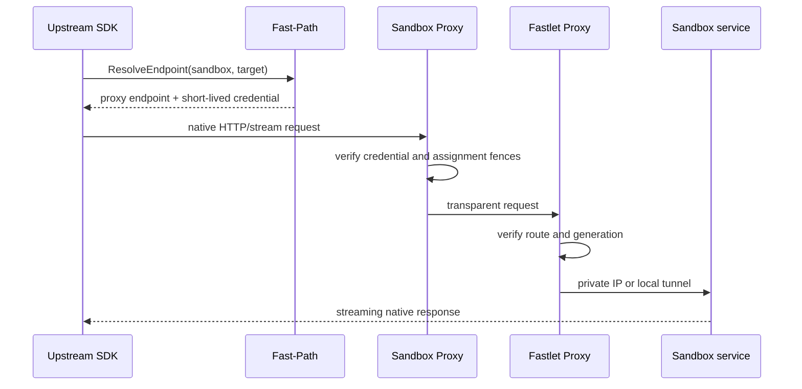

# Data plane

Fast Sandbox separates lifecycle control from user data protocols. It resolves
and authenticates a path to a named Infra Component or user port but does not
interpret that service's application API.

## Proxy path

The default central route is:

```text
Upstream SDK
  -> ResolveEndpoint(Sandbox, component name or user port)
  -> Sandbox Proxy
  -> Fastlet Proxy
  -> DirectIP or LocalForward
  -> Infra Component or user service
```

Trusted platform ingress can request a direct route:

```text
Upstream SDK
  -> platform ingress
  -> Fastlet Proxy
  -> DirectIP or LocalForward
  -> Infra Component or user service
```

Both modes use the same assignment- and target-bound route credential. Direct
mode removes the central Sandbox Proxy hop; it does not weaken Fastlet Proxy
validation.



## Sandbox Proxy

Sandbox Proxy is a multi-active cluster entry point. It:

- validates the signed route credential;
- resolves the assigned Fastlet Pod;
- validates Sandbox UID, target port, Fastlet Pod UID, assignment attempt, route generation, and expiry;
- forwards HTTP, SSE, WebSocket, and file streams without full-response buffering.

Sandbox Proxy does not translate Execd, envd, or another service protocol.
It is not used by `DIRECT_FASTLET_PROXY`.

## Fastlet Proxy

Fastlet Proxy is a platform-owned sidecar in every Fastlet Pod. It:

- receives route publications from Fastlet over a Pod-local control channel;
- verifies the same physical and generation fences;
- resolves a component name to its locally published protocol and port;
- selects the local AccessDescriptor;
- removes Fast Sandbox route credentials before forwarding;
- dials the private IP or runtime-local tunnel.

Keeping it separate from the Fastlet process isolates streaming/data-plane lifetime from runtime control operations while retaining one Fastlet Pod deployment unit.

## Named and raw targets

Endpoint resolution accepts:

- a named Infra Component such as `execd`; or
- a raw user port.

Named component paths are:

```text
/v2/sandboxes/<uid>/components/<component-name>/...
```

Raw user-port paths are:

```text
/v2/sandboxes/<uid>/ports/<port>/...
```

The suffix, escaped path segments, query, request body, response stream, SSE,
and WebSocket upgrade are forwarded unchanged. A port reserved by an Infra
Component cannot be reached through the raw-port route.

## Route identity

A route credential binds:

- namespace;
- Sandbox UID;
- target kind;
- component name when applicable;
- resolved protocol and port;
- Fastlet Pod UID;
- assignment attempt;
- route generation;
- expiry.

Reset, reassignment, deletion, and Fastlet Pod replacement invalidate old credentials and cached routes.

Fast Sandbox uses the dedicated
`X-Fast-Sandbox-Route-Credential` header. Fastlet Proxy removes it before the
upstream hop. The application `Authorization` header is not consumed or
rewritten.

## DirectIP and LocalForward

`DirectIP` is used by runtimes that consume a Fastlet-owned network slot. The proxy dials the private IP with the caller's target port.

`LocalForward` is used when the runtime owns guest networking. The proxy connects to a loopback tunnel, sends a target-port and credential preamble, and the runtime sidecar forwards to the correct guest.

## Protocol ownership

The caller must know the service protocol. For example, `fastctl opensandbox` uses the OpenSandbox Go SDK for Execd command and file operations.

Fast Sandbox owns:

- route discovery;
- short-lived caller credentials;
- assignment and generation fencing;
- transparent transport.

The Infra Component owns:

- request and response schema;
- command execution;
- file operations;
- PTY behavior;
- process output and service-specific errors.

For OpenSandbox Execd, `fastctl opensandbox` selects the official OpenSandbox
SDK while component `execd` selects the named route. Execd runs without its
optional component-native access token.

## Route freshness

A gateway may cache a resolved route until shortly before credential expiry.
It must invalidate the entry after reassignment, route-stale rejection,
credential expiry, or Fastlet Pod failure.

Routing failures are rejected before application forwarding when possible. A
gateway must not blindly replay non-idempotent or streaming requests after
refreshing a route.

## Diagnostics

`fastctl diagnostics sandbox` uses the lifecycle control plane and a bounded Fastlet event ring. It does not depend on the Sandbox data plane and does not represent user process stdout.

See the [Infra Components reference](../reference/infra-components.md) and
[OpenSandbox integration](../guides/opensandbox-integration.md).
